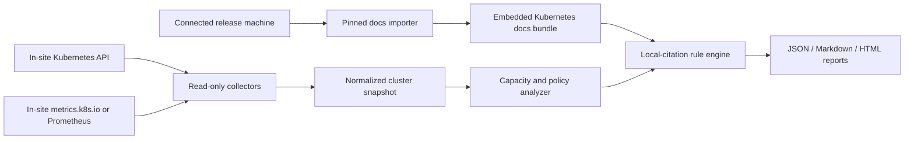

# Implementation Plan: Kubernetes Capacity Planner

## Overview

Build a read-only Kubernetes capacity planner that runs inside a dark site and reviews cluster resource posture against official Kubernetes resource-management behavior. The first deliverable should be a CLI/report generator with a reusable analysis core and a packaged Kubernetes guidance bundle. A web dashboard can be added after the collector, data model, and rules are proven.

## Delivery Milestones

### M1: Offline Platform Foundation - Complete

- OCI image, non-root runtime, SQLite migrations, Argon2id administrator authentication, secure cookies, CSRF protection, password reset command, and a v1.36 local documentation bundle are implemented.
- Container smoke test passed with TLS, a read-only root filesystem, and embedded documentation available without a runtime documentation fetch.

### M2: Cluster Collection and Capacity Engine - Implemented, Live Validation Pending

- Read-only Kubernetes collectors, optional Metrics API collection, resource normalization, workload roll-up, and source-cited rule analysis are implemented and covered by unit tests.
- Validation against a representative Kubernetes API endpoint with a mounted kubeconfig, optional API IP override, and static read-only credentials remains required before production rollout.

### M3: First Deployable Dashboard - Complete

- The dashboard provides overview, findings, nodes, namespaces, workloads, history, exports, and locally bundled documentation views.
- Browser smoke testing passed for login, manual collection, local documentation, console cleanliness, and responsive layout.

### M4: Dark-site Pilot Readiness - Partially Complete

- Read-only RBAC, backup/restore guidance, health checks, 90-day cleanup, and deployment documentation are included.
- A real dark-site pilot and optional Prometheus historical metrics remain follow-up work.

The planner should answer four practical questions:

- Can the cluster schedule the resources workloads request?
- Are workloads actually using much more or less than they request?
- Which namespaces, nodes, or workloads are most exposed to throttling, OOM kills, eviction, or quota exhaustion?
- What changes should an operator consider next, with every rule tied back to Kubernetes documentation?

## Assumptions

- Run fully within a dark site. At runtime, the application makes no public-internet requests, telemetry calls, CDN requests, or documentation fetches.
- Start with a local kubeconfig/context and read-only access to the target cluster.
- Do not mutate cluster resources in the MVP.
- Treat `metrics.k8s.io` as optional. If unavailable, still report allocatable/request/limit/policy findings and mark live usage findings as unavailable.
- Keep historical analysis optional at first; it needs an in-site Prometheus or another in-site time-series backend.
- Build releases on a connected, controlled machine that imports a curated set of official Kubernetes documentation before the release artifact enters the dark site.
- Select the documentation/rule bundle by Kubernetes minor version where possible. Warn when a cluster version has no matching bundle.

## Official Guidance Basis

- Resource requests and limits for Pods and containers: https://kubernetes.io/docs/concepts/configuration/manage-resources-containers/
- Node allocatable and reserved compute resources: https://kubernetes.io/docs/tasks/administer-cluster/reserve-compute-resources/
- Resource metrics pipeline and Metrics API: https://kubernetes.io/docs/tasks/debug/debug-cluster/resource-metrics-pipeline/
- Pod Quality of Service classes: https://kubernetes.io/docs/concepts/workloads/pods/pod-qos/
- Node-pressure eviction: https://kubernetes.io/docs/concepts/scheduling-eviction/node-pressure-eviction/
- ResourceQuotas: https://kubernetes.io/docs/concepts/policy/resource-quotas/
- LimitRanges: https://kubernetes.io/docs/concepts/policy/limit-range/
- Horizontal Pod Autoscaling: https://kubernetes.io/docs/concepts/workloads/autoscaling/horizontal-pod-autoscale/
- Node autoscaling: https://kubernetes.io/docs/concepts/cluster-administration/node-autoscaling/

The connected release process imports the full contents of the curated pages above into the application. Each imported document must retain its title, canonical source URL, Kubernetes website repository revision, source path, target Kubernetes version, import timestamp, SHA-256, and CC BY 4.0 attribution metadata. These fields make local citations inspectable and reproducible after the application is inside the dark site.

## Dark-site Documentation Behavior

- Bundle documentation with the binary or container image under a local application route such as `docs://kubernetes/v1.36/<document-id>`.
- Render all finding citations as local documentation links. Show the canonical public URL only as provenance text, never as a dependency for viewing the rule guidance.
- Include a local documentation viewer with full-text search, document version, source revision, import timestamp, and attribution.
- Include a `NOTICE` and per-document attribution so imported Kubernetes documentation remains properly credited under CC BY 4.0.
- Keep a small `docs/catalog.yaml` that maps every rule ID to the exact imported document and section it relies on.
- Build the docs bundle only in the connected release pipeline. The dark-site runtime must reject remote documentation URLs and operate correctly with network egress blocked.
- Package matching documentation/rule bundles for supported Kubernetes minor versions. If no exact match exists, continue analysis with a visible compatibility warning and avoid prescriptive version-specific remediation.

## Recommended Architecture

Use Go for the collector and analyzer because Kubernetes resource quantities, API types, and client libraries are first-class in the Go ecosystem. Start with a CLI and static reports; do not begin with a web UI until the model and rules are stable.

Proposed modules:

- `cmd/kcp`: CLI entrypoint.
- `internal/kubeclient`: kubeconfig loading, discovery, read-only clients.
- `internal/collect`: collectors for nodes, pods, controllers, quotas, limit ranges, HPAs, events, and metrics.
- `internal/model`: normalized snapshot structs and resource quantity helpers.
- `internal/analyze`: aggregation by cluster, node pool, namespace, workload, and node.
- `internal/docs`: local documentation registry, citation resolver, manifest validation, and offline search.
- `internal/rules`: versioned, local-document-cited rule catalog.
- `internal/report`: JSON, Markdown, and HTML report rendering.
- `docs/catalog.yaml`: curated source document and section catalog used by the connected import process.
- `assets/k8s-docs`: imported, rendered documentation and `manifest.json` embedded in the release artifact.
- `tools/docs-sync`: connected-build importer that pins the upstream Kubernetes website revision and generates the documentation bundle.
- `NOTICE`: Kubernetes documentation attribution and licensing notice.
- `deploy/rbac`: read-only ClusterRole, ServiceAccount, and example manifests.
- `testdata/snapshots`: offline fixtures for tests and demos.

Data flow:

## Core Reports

- Cluster capacity: node capacity, node allocatable, requested CPU/memory/ephemeral storage, configured limits, live usage when available, and remaining schedulable headroom.
- Node and node-pool view: allocatable vs requested, live usage, pressure conditions, taints, unschedulable nodes, and pod distribution.
- Namespace view: quota usage, LimitRange coverage, request/limit totals, and top workloads by requested and live usage.
- Workload view: requests, limits, live usage ratios, QoS class, HPA status, replica count, pending pods, recent OOM/eviction signals, and right-sizing hints.
- Findings view: severity, evidence, local documentation link, canonical source provenance, affected resources, and recommended next action.

## Rule Catalog for MVP

- Missing CPU or memory requests: flag because requests drive scheduling and QoS, with a link to the local resource-management guidance.
- Schedulable headroom pressure: sum active pod requests against node allocatable, not node capacity.
- Limit pressure: flag CPU usage near limits as throttling risk and memory usage near limits as OOM risk.
- QoS eviction exposure: highlight BestEffort and Burstable workloads, especially under node pressure.
- Node pressure: report MemoryPressure, DiskPressure, PIDPressure, and related recent eviction events.
- Quota pressure: report ResourceQuota hard/used percentages and namespaces without quota when namespace governance is expected.
- LimitRange coverage: report whether namespaces define defaults/min/max constraints for CPU and memory.
- Metrics availability: explicitly report when live usage cannot be evaluated because Metrics API is missing or incomplete.
- HPA coverage: show workloads with HPA, current targets, and whether resource metrics needed for scaling are present.

## Implementation Tasks

### Task 1: Bootstrap the Project Skeleton

**Description:** Initialize a Go module, CLI structure, lint/test commands, README, and placeholder packages.

**Acceptance criteria:**
- `go test ./...` runs successfully.
- CLI supports `kcp version` and `kcp analyze --help`.
- README explains read-only intent and required cluster access.

**Verification:**
- `go test ./...`
- `go run ./cmd/kcp version`

**Dependencies:** None

**Estimated scope:** Medium

### Task 2: Build the Offline Kubernetes Documentation Bundle

**Description:** Create the connected-build import process that reads the curated documentation catalog, imports the required official Kubernetes pages, and packages them for fully offline viewing in the application.

**Acceptance criteria:**
- The curated guidance pages are available locally in the built CLI/report artifact without external network access.
- Every imported document records title, canonical URL, upstream repository revision, source path, Kubernetes version, import timestamp, SHA-256, and CC BY 4.0 attribution.
- The bundle includes `NOTICE`, a machine-readable manifest, and a rule-to-document/section catalog.
- A blocked-egress test proves that document viewing and finding citations need no public network access.

**Verification:**
- Importer test against a pinned local upstream fixture.
- Artifact inspection confirms required documents, manifest fields, and attribution are present.
- Run report/viewer tests with network egress disabled.

**Dependencies:** Task 1

**Estimated scope:** Medium

### Task 3: Define Snapshot Model and Resource Math

**Description:** Create normalized structs for nodes, pods, containers, namespaces, policies, metrics, findings, and resource quantities.

**Acceptance criteria:**
- CPU, memory, and ephemeral storage quantities are parsed and rendered consistently.
- Aggregations distinguish capacity, allocatable, requested, limited, and live usage.
- Unit tests cover millicores, cores, bytes, Ki/Mi/Gi, and missing values.

**Verification:**
- `go test ./internal/model ./internal/analyze`

**Dependencies:** Task 1

**Estimated scope:** Medium

### Task 4: Build Offline Fixture Loader

**Description:** Allow analysis from saved JSON/YAML snapshots before live cluster access is implemented.

**Acceptance criteria:**
- CLI can run `kcp analyze --from-file testdata/snapshots/basic.json`.
- Fixture output includes cluster, namespace, node, workload, and finding summaries.
- Bad fixture input returns clear validation errors.

**Verification:**
- `go test ./internal/collect ./internal/report`
- Manual fixture run

**Dependencies:** Tasks 1 and 3

**Estimated scope:** Medium

### Task 5: Build Live Kubernetes Collectors

**Description:** Collect nodes, namespaces, pods, owner references, controllers, ResourceQuotas, LimitRanges, HPAs, and recent warning events using read-only clients.

**Acceptance criteria:**
- CLI can analyze the current kube context.
- Missing API groups or RBAC gaps are reported as partial-data warnings, not crashes.
- Owner references roll pods up to Deployment, StatefulSet, DaemonSet, Job, or standalone Pod.

**Verification:**
- `go test ./internal/kubeclient ./internal/collect`
- Manual run against kind/minikube

**Dependencies:** Tasks 1, 3, and 4

**Estimated scope:** Medium

### Task 6: Add Metrics API Collector

**Description:** Read node and pod usage from `metrics.k8s.io` when available and merge it into the snapshot.

**Acceptance criteria:**
- Reports include live CPU and memory usage when Metrics API is installed.
- If Metrics API is absent, reports state that live usage analysis is unavailable.
- Metrics timestamps and windows are preserved.

**Verification:**
- `go test ./internal/collect ./internal/analyze`
- Manual run with and without metrics-server

**Dependencies:** Task 5

**Estimated scope:** Medium

### Task 7: Implement MVP Rule Engine

**Description:** Implement the first local-document-cited rules for requests, allocatable headroom, limits, QoS, node pressure, quotas, LimitRanges, metrics coverage, and HPA coverage.

**Acceptance criteria:**
- Each finding has severity, category, affected object, evidence, recommendation, local document reference, and canonical source provenance.
- Every rule ID maps to an imported document and precise section in `docs/catalog.yaml`.
- Unit tests cover normal, warning, and critical thresholds.
- Thresholds are configurable without recompiling.

**Verification:**
- `go test ./internal/rules ./internal/analyze`

**Dependencies:** Tasks 2-6

**Estimated scope:** Medium

### Task 8: Render Reports

**Description:** Produce machine-readable JSON plus human-readable Markdown and static HTML.

**Acceptance criteria:**
- `--output json`, `--output markdown`, and `--output html` work.
- Reports are grouped by severity, namespace, workload, and node.
- Static HTML is self-contained, includes the local documentation bundle, and is usable without a server or internet connection.

**Verification:**
- `go test ./internal/report`
- Manual report review from fixture and kind/minikube

**Dependencies:** Task 7

**Estimated scope:** Medium

### Task 9: Provide Read-only RBAC Manifests

**Description:** Add example manifests for running the planner in-cluster or with a service account.

**Acceptance criteria:**
- Manifests grant read-only access to required core, apps, autoscaling, policy, events, and metrics resources.
- README documents minimal RBAC and kubeconfig usage.
- No secret collection or write permissions are required.

**Verification:**
- `kubectl auth can-i` examples in README
- Manifest review

**Dependencies:** Task 5

**Estimated scope:** Small

### Task 10: Add Integration Test Harness

**Description:** Use kind or minikube fixtures to validate collection and reports end-to-end.

**Acceptance criteria:**
- Test cluster includes workloads with missing requests, quotas, limits, HPA, and pressure-like event fixtures.
- Golden reports are stable.
- CI can run unit tests without a cluster and integration tests when a cluster is available.

**Verification:**
- `go test ./...`
- Optional integration command documented in README

**Dependencies:** Tasks 5-8

**Estimated scope:** Medium

### Task 11: Add Historical Metrics Backend

**Description:** Add optional Prometheus support for p95/p99 usage, trends, and right-sizing recommendations.

**Acceptance criteria:**
- User can configure an in-site Prometheus URL and query window.
- Right-sizing uses historical percentiles when available.
- Reports clearly separate live Metrics API data from historical metrics.

**Verification:**
- Unit tests with mocked Prometheus responses
- Manual run against a Prometheus-enabled cluster

**Dependencies:** Tasks 6-8

**Estimated scope:** Medium

### Task 12: Add Dashboard

**Description:** Build a small web UI that reads generated JSON reports or invokes the analyzer locally.

**Acceptance criteria:**
- First screen is the actual cluster review, not a marketing page.
- Views include cluster overview, findings, namespaces, nodes, and workloads.
- UI remains read-only, works without internet access, and can load a saved report without cluster credentials.
- Findings open the bundled local documentation viewer rather than a public web page.

**Verification:**
- Frontend build/test command
- Browser smoke test on desktop and mobile viewport

**Dependencies:** Tasks 7-8

**Estimated scope:** Medium

## Checkpoints

### Checkpoint A: After Tasks 1-4

- Project builds and tests.
- Imported Kubernetes guidance is available offline with complete manifest and attribution.
- Offline fixture analysis works.
- Data model is stable enough for live collection.

### Checkpoint B: After Tasks 5-8

- Live cluster analysis works.
- JSON, Markdown, and HTML reports are useful.
- MVP rule findings open local, source-cited documentation.

### Checkpoint C: After Tasks 9-10

- Tool is safe to run with read-only RBAC.
- Unit and integration verification are documented.

### Checkpoint D: After Tasks 11-12

- Historical right-sizing and dashboard are available as optional higher-level features.

## Risks and Mitigations

| Risk | Impact | Mitigation |
| --- | --- | --- |
| Live usage is mistaken for schedulable capacity | High | Keep request/allocatable analysis separate from metrics usage throughout the model and reports. |
| Metrics API is not installed | Medium | Make metrics optional and report partial-data warnings. |
| Right-sizing based on short samples is misleading | High | Put historical right-sizing behind Prometheus or another time-series backend. |
| Provider-specific node pools and autoscalers vary | Medium | Start with generic Kubernetes APIs, then add provider adapters later. |
| Rules become opinionated without sources | High | Require every rule to carry a local documentation reference, canonical source provenance, and evidence text. |
| Dark-site deployment tries to fetch remote assets | High | Embed documentation, fonts, and UI assets; block egress in automated tests; prohibit runtime remote URLs. |
| Imported docs do not match the target cluster version | Medium | Pin bundle metadata to Kubernetes minor versions and surface a compatibility warning for unmatched clusters. |
| Documentation provenance is lost during updates | Medium | Require immutable upstream revision, manifest hash, source path, import timestamp, and attribution for every document. |
| RBAC is too broad | Medium | Ship read-only manifests and document required resources explicitly. |

## Open Questions

- Should the first user interface be CLI/static report only, or should a dashboard be part of MVP?
- Which clusters should we target first: kind/minikube, EKS, GKE, AKS, on-prem, or mixed?
- Do you already run metrics-server and Prometheus?
- Should recommendations include estimated cloud cost, or stay Kubernetes-native first?
- Should the tool support multiple clusters in the first version, or single-context analysis first?
- Which Kubernetes minor versions must be supported in the first dark-site release?
